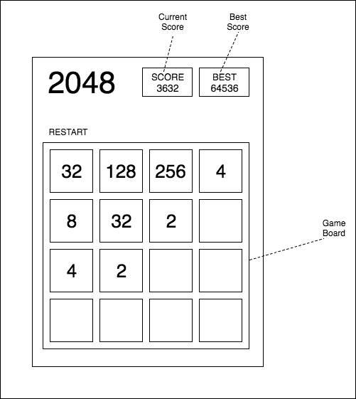
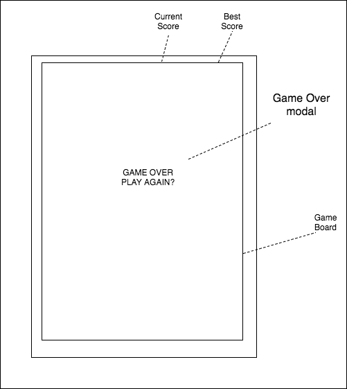

# JS Project Proposal: 4096
### About 4096
4096 is a single-player sliding-block puzzle game. The game is played on a square board with 16 squares, some of which are populated with numbers (all being powers of 2) - the rest of the squares are empty. The user can swipe left, right, up, and down which causes any available number-tiles to slide as far as they can in the direction of the swipe. Each time a swipe occurs a new number-tile is generated in a random empty location. When two number-tiles of the same value collide, they collapse into a single number-tile whose value is equal to the sum of the two. The object of the game is to get as high a number as possible before the board fills up.

### MVP
To meet requirements necessary for playability, the game must meet the following criteria:
- Number-tiles slide until they hit the wall or another number whose value does not equal the value of the sliding tile
- When two number-tiles of equal value collide, they collapse into a single tile whose value is equal to the sum of the two tiles
- With each swipe a new number-tile is generated in a random empty location
- The `Score` box will keep track of the user's current score, which will be calculated from all of the collapse events

### Wireframes
The game will display the 4 x 4 grid along with the user's current and best scores. Controls for the game will be the arrow keys allowing the user to pick which direction they wish to swipe.

Game board and number-tiles.

Game-over modal.

### Technologies and Libraries

In addition to using `JavaScript` for implementing game logic, I will use `webpack` for bundling script files and `Moustrap.js` for binding keyboard events. CSS3 will be used for the sliding animations for the number-tiles.

### Implementation Timeline
#### Day 1
Plan out the game logic without any styling or sliding animations. Especially work out the logic related to tile-collapse when two tiles share the same number. Break out sliding logic into up and down directions.

#### Day 2
Spend part of Day 2 learning `Moustrap` for the purpose of binding keyboard events for the up, left, down, and right arrows. Track player's score.

#### Day 3
Leverage CSS3's animation effects for slick transitions of moving tiles.

### Bonus Features
- Dropdown menu to change tile and background colors
