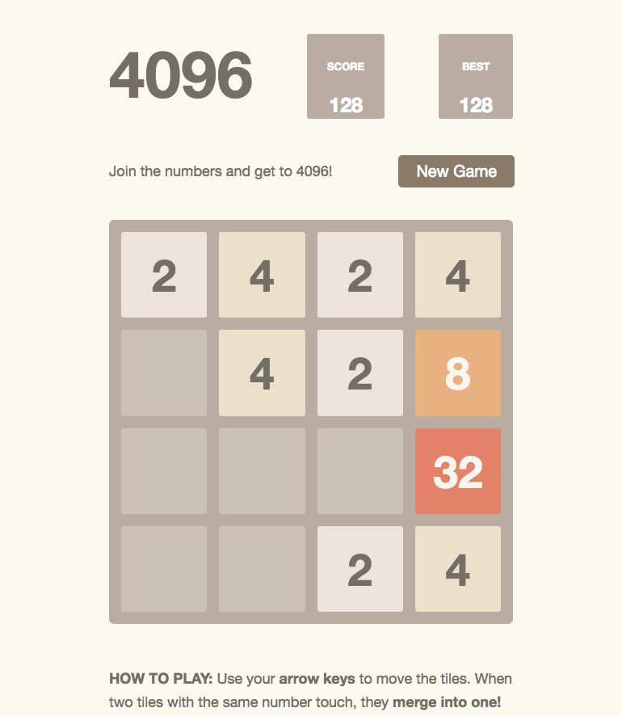
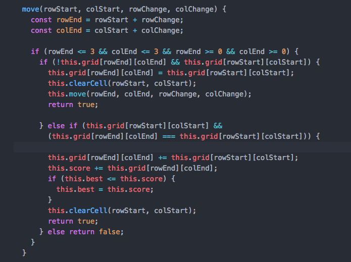
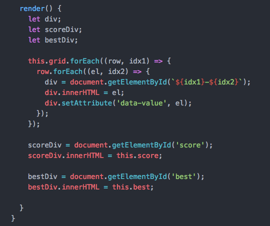

# 4096

4096 is a clone of the popular sliding-block puzzle game, 2048.

[4096 Live](alex-kornfeld.com/4096)

## The Goal
There goal of 4096 isn't so much to 'win', but to last as long as you can before the board fills up with new tiles. Slide the tiles into one another and get them to add to a higher and higher tile!

## Game Mechanics
The game listens for keydown events on the left-, right-, up-, and down-arrow keys in order to move the board tiles as far as they can go in a given direction.

#### Movement Rules
- [ ] If a tile hits an empty space, it keeps going;
- [ ] If a tile hits the wall or another tile with a different number value, it stops;
- [ ] If a tile hits another tile with the same number-value, it merges into that tile at that tile's position and their number-value increases by that amount;
- [ ] Every time a move is successfully made in any direction, a random tile (either a 2 or a 4) is generated at a random empty position.

## The Code

The `move` function as defined in the `Board` class determines movement rules for the board. Checking if the result of a move will remain in bounds, the function then checks if the result of the move will land the tile on an empty spot or a spot with a tile of equal value. If the former is the case, the tile will recursively continue to move. If the latter is the case, the tiles will merge and stop moving.

In the `Board` class' render method, the background board of divs is dynamically updated by setting the `innerHTML` of the divs with the number value stored at that position in the grid. The divs are then given a `data-value` attribute set to that number-value so that the color may be updated directly with CSS.

## Moving Forward
Moving forward the biggest feature I want to implement would be sliding animations for the tiles. This will require rearchitecting the game to use a Tile class rather than updating the background divs directly so that the tiles may track their former and current positions.
